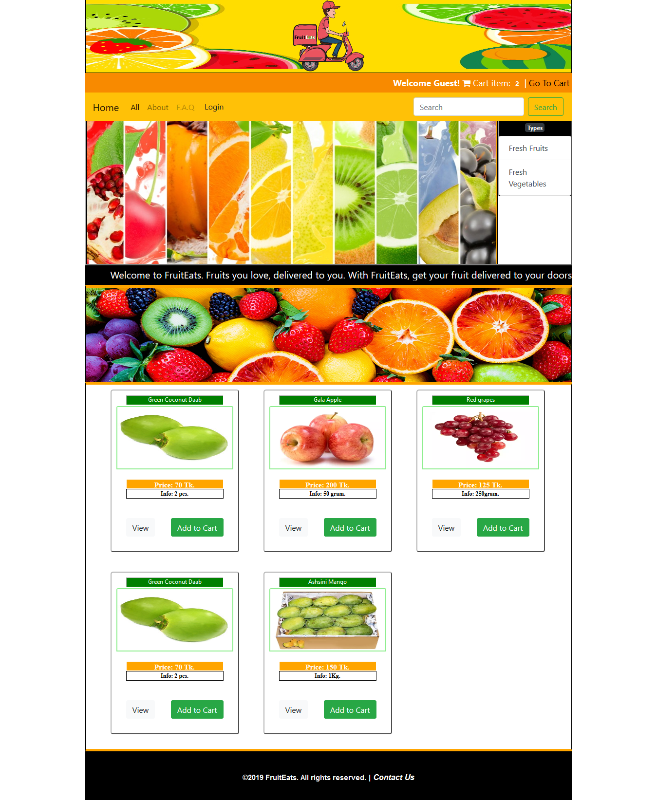
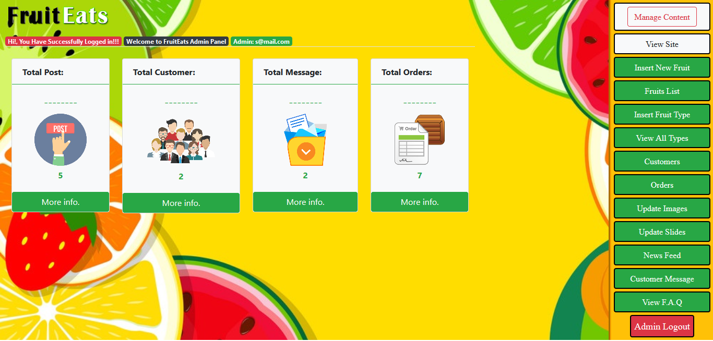

# 
<h3>Project Name:</h3>Fruit Delivery Service.

<h5>Frontend Sample Image</h5>
<figure>
  
  <figcaption>Frontend Sample</figcaption>
</figure> 

<h5>Backend Sample Image</h5>
<figure>
  
  <figcaption>Backend Sample</figcaption>
</figure> 

This is current semester (4.2) "Network Programming Lab Project" which we have made using Jsp, Servlet, Mysql, html, css, bootstrap.

<h4>Group Project Members :</h4>
<ul style="list-style-type:square">
<li>Sagor Ahamed</li>

<li>Nabil Ahmed</li>

<li>Shanjoy Paul Shuvo</li>
</ul>
